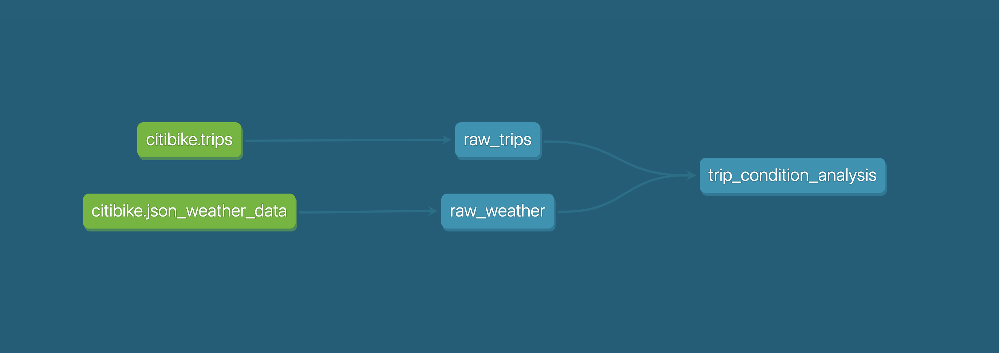

# dbt-postgres-demo

## Introduction

I've thrown a quick demo together to help me learn about [dbt](https://www.getdbt.com/) with Snowflake.

> Example of the lineage graph generated using table referencing

The demo:
1. Sets up some test data using the [Snowflake free trial lab](https://s3.amazonaws.com/snowflake-workshop-lab/Snowflake_free_trial_LabGuide.pdf) data
1. Sets up a DBT project and profile
1. Creates relevant models/views

:warning: **As this is a demo, it's not fit for production use.** I've deliberately put the `dbt-profiles` inside this repo to make it easy for a quickstart. These both contain secrets, which if were real, should **_never_** end up in Git. Ever.

## Quick Start

Run: `make all`

## Prerequisites

Commands have been written and tested on MacOS Big Sur.

* A Snowflake trial account: https://trial.snowflake.com/
* `brew tap dbt-labs/dbt && brew install dbt`
* `brew install --cask snowflake-snowsql`
* (Optional) Add to `~/.zshrc`: `alias snowsql=/Applications/SnowSQL.app/Contents/MacOS/snowsql`
* Setup your SnowSQL config in ` ~/.snowsql/config`

## Commands

### $ make all

Runs all of the following commands in the correct order to end up with a database, with data imported, seeds, models and everything ready to go.

### $ make setup

Creates (or replaces) all the Snowflake required tables, stages then imports the data.

### $ make run

Runs `dbt` against Snowflake, creating the raw table layer and models as defined in `/models`

### $ make docs-generate

Generates the automatic `dbt` documentation, ready to be viewed.

### $ make docs-serve

Starts the built in `dbt` docs server so it can be viewed interactively 

## Acknowledgements

The test/demo data is taken from https://s3.amazonaws.com/snowflake-workshop-lab/Snowflake_free_trial_LabGuide.pdf